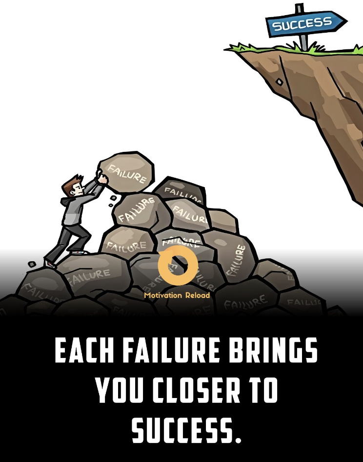

### Find out with TDD

Small utility repo with out-of-box TDD environment tolerating failing cases. Tests are failing until one approach finally returns desired result.

```ts
describe("testing of approaches", () => {
  const EXPECTED_RESULT = "Ok"

  const tester = new ApproachesTester(EXPECTED_RESULT)

  afterAll(() => {
    tester.printResult()
    tester.verifyIfSomeApproachSucceed()
  })

  it.each`
    approach     | approachName
    ${approach1} | ${"First test approach"}
    ${approach2} | ${"Second test approach"}
    ${approach3} | ${"Third test approach"}
  `("should try run $approachName", async ({approach, approachName}) => {
    await tester.testApproach(approach, approachName)
  })
})
```

### Setup

Install deps and run in debug mode:

[](http://www.youtube.com/watch?v=rtRSBnF4hLA)

### Here is some motivation embracing failures




